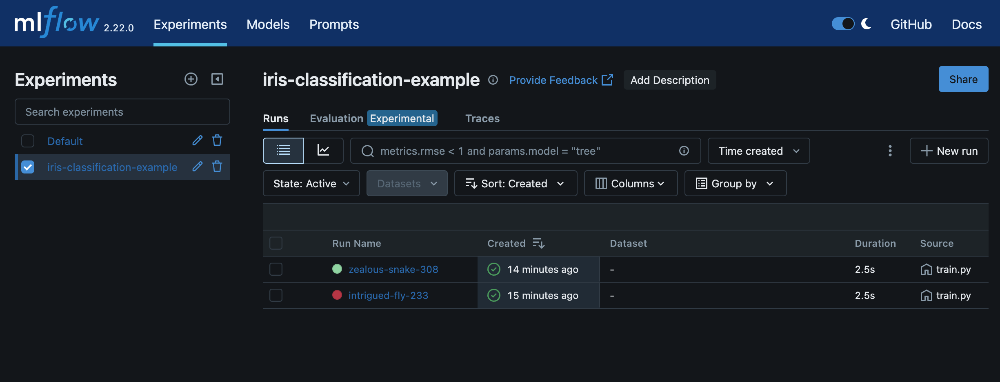

# MLflow with Scikit-Learn Project

Простой ML-проект с использованием scikit-learn и MLflow в Docker. Проект демонстрирует как:
- Обучать модель классификации с использованием scikit-learn
- Отслеживать эксперименты с помощью MLflow
- Запускать всё в контейнерах Docker
- Деплоить модель в виде веб-сервиса с пользовательским интерфейсом

## Обзор проекта

Проект включает:
1. Классификацию ирисов (датасет Iris) с использованием RandomForest
2. Логирование метрик, параметров и моделей в MLflow
3. Скрипты для обучения и предсказаний
4. Docker и docker-compose для запуска
5. Веб-интерфейс для использования модели через браузер

## Структура проекта

```
.
├── Dockerfile              # Dockerfile для создания образа
├── docker-compose.yml      # Конфигурация docker-compose
├── requirements.txt        # Зависимости Python
├── train.py                # Скрипт для обучения модели
├── predict.py              # Скрипт для выполнения предсказаний
├── app.py                  # Flask приложение для сервинга модели
├── templates/              # HTML шаблоны для веб-интерфейса
│   ├── index.html          # Главная страница с формой ввода
│   └── result.html         # Страница с результатами предсказания
├── static/                 # Статические файлы
│   ├── css/                # CSS стили
│   └── js/                 # JavaScript файлы
└── models/                 # Директория для сохранения обученных моделей
```

## Как использовать

### Запуск с Docker

1. Сборка и запуск с docker-compose:

```bash
docker-compose up
```

Это запустит:
- MLflow сервер на http://localhost:5454
- Процесс обучения модели (train.py)
- Веб-интерфейс для использования модели на http://localhost:8080

2. Для запуска предсказаний через командную строку:

```bash
docker-compose run ml-app python predict.py
```

Или с указанием конкретных параметров:

```bash
docker-compose run ml-app python predict.py 5.1 3.5 1.4 0.2
```

### Веб-интерфейс для модели

После запуска, доступны следующие URL:
- http://localhost:8080 - Веб-интерфейс для ввода данных и получения предсказаний
- http://localhost:8080/api/info - Информация об API (для разработчиков)

### REST API

Модель также доступна через REST API:

```bash
# Пример запроса с использованием curl
curl -X POST http://localhost:8080/predict \
  -H "Content-Type: application/json" \
  -d '{"sepal_length": 5.1, "sepal_width": 3.5, "petal_length": 1.4, "petal_width": 0.2}'
```

### Запуск без Docker

1. Установите зависимости:

```bash
pip install -r requirements.txt
```

2. Запустите MLflow:

```bash
mlflow server --host 0.0.0.0 --port 5000
```

3. В отдельном терминале обучите модель:

```bash
python train.py
```

4. Запустите веб-сервис:

```bash
python app.py
```

## MLflow UI

После запуска, откройте MLflow UI в браузере по адресу: http://localhost:5454

В интерфейсе MLflow возможно
- Просматривать запуски обучения
- Сравнивать метрики и параметры разных моделей
- Загружать сохраненные модели
- Просматривать артефакты 


